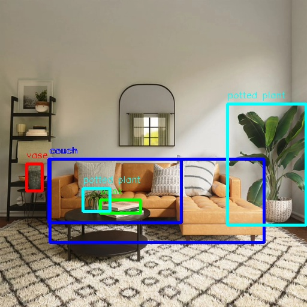

# 2.6 模型推理

## 功能介绍

本章节介绍模型推理功能的使用，输入一张本地图片进行推理，得到渲染后的图片并保存在本地。

代码仓库：<https://github.com/HorizonRDK/hobot_dnn>

## 支持平台

| 平台    | 运行方式     |
| ------- | ------------ |
| RDK X3, RDK X3 Module| Ubuntu 20.04 |
| X86     | Ubuntu 20.04 |

***RDK Ultra模型推理功能体验参考[3. Boxs算法仓库](../category/boxs/)。***

## 准备工作

### 地平线RDK平台

1. 地平线RDK已烧录好地平线提供的Ubuntu 20.04系统镜像。

2. 地平线RDK已成功安装TogetheROS.Bot。

### X86平台

1. 确认X86平台系统为Ubuntu 20.04，且已成功安装tros.b。

## 使用介绍

使用hobot_dnn配置文件中的本地JPEG格式图片和模型（FCOS目标检测模型，支持的目标检测类型包括人、动物、水果、交通工具等共80种类型），通过回灌进行推理，并存储渲染后的图片。

```shell
# 配置tros.b环境
source /opt/tros/setup.bash

# 从tros.b的安装路径中拷贝出运行示例需要的配置文件。config中为example使用的模型，回灌使用的本地图片
cp -r /opt/tros/lib/dnn_node_example/config/ .

# 使用本地jpg格式图片进行回灌预测，并存储渲染后的图片
ros2 launch dnn_node_example dnn_node_example_feedback.launch.py dnn_example_config_file:=config/fcosworkconfig.json dnn_example_image:=config/target.jpg
```

运行成功后，在运行路径下自动保存渲染后的图片，命名方式为render_feedback_0_0.jpeg，使用ctrl+c退出程序。

运行命令中的参数说明，以及如何订阅并使用从camera发布的图片进行算法推理的运行方法参考dnn_node_example package源码中的README.md。

## 结果分析

在运行终端输出如下信息：

```text
[example-1] [INFO] [1679901151.612290039] [ImageUtils]: target size: 6
[example-1] [INFO] [1679901151.612314489] [ImageUtils]: target type: couch, rois.size: 1
[example-1] [INFO] [1679901151.612326734] [ImageUtils]: roi.type: couch, x_offset: 83 y_offset: 265 width: 357 height: 139
[example-1] [INFO] [1679901151.612412454] [ImageUtils]: target type: potted plant, rois.size: 1
[example-1] [INFO] [1679901151.612426522] [ImageUtils]: roi.type: potted plant, x_offset: 379 y_offset: 173 width: 131 height: 202
[example-1] [INFO] [1679901151.612472961] [ImageUtils]: target type: book, rois.size: 1
[example-1] [INFO] [1679901151.612497709] [ImageUtils]: roi.type: book, x_offset: 167 y_offset: 333 width: 67 height: 22
[example-1] [INFO] [1679901151.612522859] [ImageUtils]: target type: vase, rois.size: 1
[example-1] [INFO] [1679901151.612533487] [ImageUtils]: roi.type: vase, x_offset: 44 y_offset: 273 width: 26 height: 45
[example-1] [INFO] [1679901151.612557172] [ImageUtils]: target type: couch, rois.size: 1
[example-1] [INFO] [1679901151.612567740] [ImageUtils]: roi.type: couch, x_offset: 81 y_offset: 265 width: 221 height: 106
[example-1] [INFO] [1679901151.612606444] [ImageUtils]: target type: potted plant, rois.size: 1
[example-1] [INFO] [1679901151.612617518] [ImageUtils]: roi.type: potted plant, x_offset: 138 y_offset: 314 width: 45 height: 38
[example-1] [WARN] [1679901151.612652352] [ImageUtils]: Draw result to file: render_feedback_0_0.jpeg
```

输出log显示，算法使用输入的图片推理出6个目标，并输出了每个目标的类别（target type）和检测框坐标（检测框左上位置的x坐标x_offset和y坐标y_offset，检测框的宽width和高height）。存储的渲染图片文件名为render_feedback_0_0.jpeg。

渲染后的图片render_feedback_0_0.jpeg：


